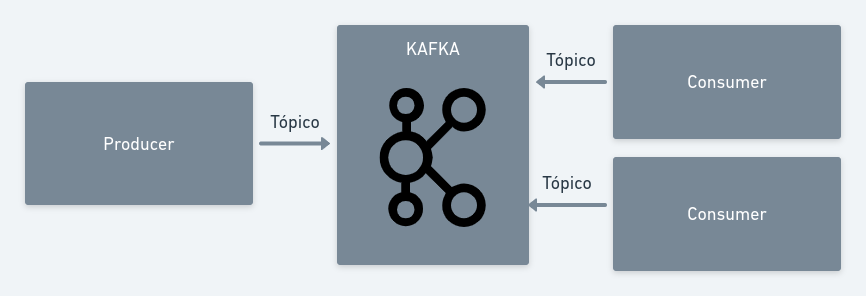

# What is Apache Kafka?
> Apache Kafka is an open-source distributed event streaming platform used by thousands of companies for high-performance data pipelines, streaming analytics, data integration, and mission-critical applications.

https://kafka.apache.org/

# Apache Kafka Features
- High throughput
- High Availabilty
- Low latency
- Scability
- Storage
- Can be used for many languages

# Topics
Topics are segmented channels of information where stored information from producers and to make available for consumers read it.

